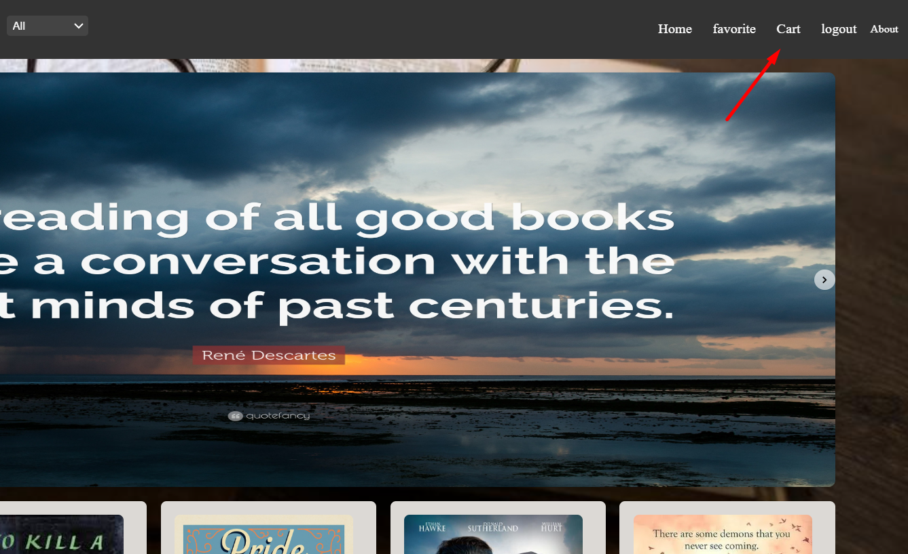
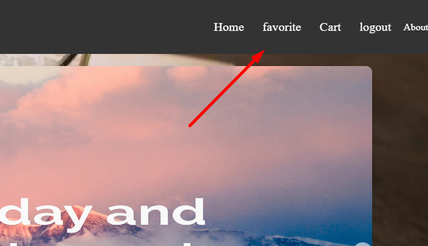
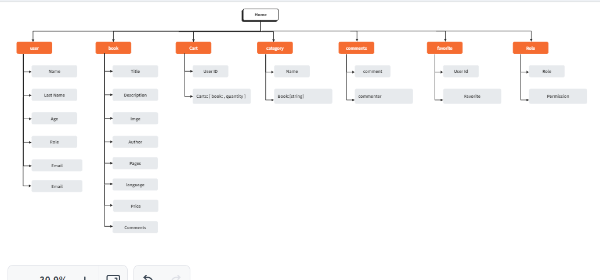

<p align="center">
<a href="https://www.meraki-academy.org" target="_blank" rel="noopener noreferrer">
 
 </a>
</p>

<h3 align="center"> Book Store
</h3>

---


<a href=''>Demo</a>
    <br> 
</p>

## 📝 Table of Contents

- [About](#about)
- [Getting Started](#getting_started)
- [Usage](#usage)
- [Built Using](#built_using)
- [User Story](#user_story)
- [Data Flow](#data_flow)
- [Guided By](#guided_by)

## 🧐 About <a name = "about"></a>

The main goal of creating my project is to provide books that talk about the fields of life and facilitate the selection process for the user

## 🏁 Getting Started <a name = "getting_started"></a>

These instructions will get you a copy of the project up and running on your local machine for development and testing purposes.

### Prerequisites

- Visual Studio Code follow this <a href=''>link</a> to install.
- Git Bash follow this <a href=''>link</a> to install.
- MongoDB follow this <a href=''>link</a> to install.
- Node.js follow this <a href=''>link</a> to install.

### Installing:

1. Clone the repo to your local machine using git bash.

```
git clone https://github.com/C11-OsamaAlrwajbeh/MERAKI_Academy_Project_4.git
```

2. Install packeges repeat this step in backend and frontend folder

```
npm i
```

3. Run server using git bash inside backend folder

```
npm run dev
```

4. Run application using git bash inside frontend folder

```
npm run start
```

Now app ready to use

 


## 🎈 Usage <a name="usage"></a>

Ex.
- You can click on register to sign up on the page

- After registering, click on login and enter your email and password

- You can click on the **Home** tab provided in the navigation bar to view the home section
 
- You can click on the **Add to cart** button to add this product to your cart but you have to be one of our users, so you should create an account
 
-You can click on the **Add to faveriot** button 

-Books you add to favorites and cart can be viewed from the navigation bar




## ⛏️ Built Using <a name = "built_using"></a>

- [MongoDB](https://www.mongodb.com/) - Database
- [Express JS](https://expressjs.com/) - Server Framework
- [React JS](https://https://reactjs.org/) - Web Framework
- [Node JS](https://nodejs.org/en/) - Server Environment

## User Story <a name = "#user_story"></a>

Your trello board link
<a href='https://trello.com/b/pW7u6TOj/project-4'>Trello</a>

## Data Flow 

</a>

## ⚠️ Guided By <a name = "guided_by"></a>

This project is guided by ©️ **[MERAKI Academy](https://www.meraki-academy.org)**